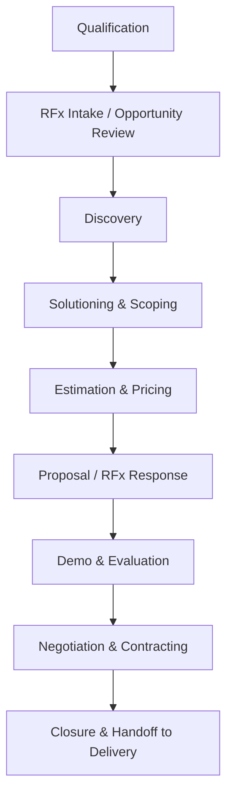

# Pre-Sales Lifecycle and Opportunity Stages
{: .no_toc }

*Read duration: 3:47*

Every opportunity that reaches your desk moves through a predictable sequence of stages, even when the client's process feels chaotic. Knowing the stage you're in tells you what your job is right now — and just as usefully, what it isn't yet. Chasing a detailed estimate before you've qualified whether the deal is winnable wastes hours; skipping straight to a proposal before discovery has surfaced the client's actual constraints produces a document that looks confident and is wrong.

**Qualification** comes first: is this a real opportunity, with budget, authority, and a timeline — or a fishing expedition? A pre-sales rep who skips qualification ends up burning weeks scoping deals that were never going to close. Next is **RFx intake**, where a formal RFI, RFQ, or RFP (or an informal request, if the client hasn't issued one) gets logged, reviewed for fit, and triaged for a go/no-go decision before real effort is committed.

Once you're in, **discovery** is where the actual requirements get uncovered — not the requirements the client wrote down, but the pain, impact, and constraints behind them. This is the stage most often rushed, and it's the one that determines whether everything downstream is built on solid ground. **Solutioning and scoping** turns discovery output into a concrete technical approach: what's in scope, what's explicitly out, what assumptions the solution depends on.

**Estimation and pricing** attaches effort, cost, and a commercial model (time-and-materials, fixed price, retainer, or outcome-based) to that scope — this is where solutions architects and delivery leads get pulled in to sanity-check the numbers before they go external. That feeds the **proposal or RFx response**, the formal document that packages scope, approach, pricing, and value into something the client can evaluate against competitors. Many deals then include a **demo and evaluation** stage, where the solution gets proven live rather than just described on paper.

**Negotiation and contracting** is where legal and commercial terms — NDAs, MSAs, statements of work — get finalized, and where scope defined loosely earlier in the cycle either gets tightened up or comes back to bite you. Finally, **closure and handoff** is the stage most pre-sales training skips but shouldn't: a signed deal has to transfer cleanly to the delivery team, with the assumptions, scope boundaries, and client context intact.

{: .important }
> Skipping or compressing a stage doesn't remove the risk that stage exists to manage — it just moves that risk downstream, usually into delivery, where it's far more expensive to fix. If discovery gets rushed, expect scope disputes during the contracting or delivery stage instead.

Deals rarely move through these stages in a straight line — you'll loop back to discovery after a client stakeholder changes, or revisit estimation after a scope negotiation — but the stage names and their objectives stay consistent, and that shared vocabulary is what lets an account executive, an architect, and a delivery lead track the same deal without talking past each other.

<!-- prevnext:start -->

---

| [&larr; Previous: What is Pre-Sales and Why It Matters](what-is-pre-sales-and-why-it-matters) | [Next: Roles in Pre-Sales (AE, Architect, Legal, Delivery) &rarr;](roles-in-pre-sales-ae-architect-legal-delivery) |
|:---|---:|

<!-- prevnext:end -->
