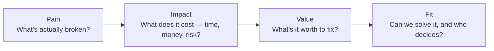

# The Discovery Call Framework (Pain → Impact → Value → Fit)
{: .no_toc }

*Read duration: 2:55*

Every strong discovery call, however different the industry or stakeholder, follows the same underlying shape: **Pain → Impact → Value → Fit**. Treat it as a sequence, not a checklist you can jump around in — each step earns you the right to ask the next one, and skipping ahead is exactly how reps end up proposing a solution to a problem the client never confirmed they have.

**Pain** is the surface-level complaint — "our reporting is slow," "onboarding takes too long," "we keep missing SLAs." Don't stop here; a stated pain is a symptom, not a diagnosis. Ask what's causing it and who feels it first.

**Impact** is where you quantify the pain in terms the client already tracks — hours lost, dollars spent, deals delayed, compliance risk taken on. Going back to a familiar example: "reporting is slow" becomes "our finance team spends twenty hours a month manually reconciling numbers before every board meeting, and last quarter a reporting error delayed a funding decision by two weeks." Impact is what turns a complaint into a business case — without it, you're pricing against a preference, not a problem.

**Value** flips the question around: what is it worth to fix this? If twenty hours a month at a loaded analyst rate is real money, and a delayed funding decision has its own cost, the client — not you — starts building the ROI case for solving it. Let them say the number first if you can; a value figure the client volunteers survives budget scrutiny far better than one you calculated for them.

**Fit** is the last gate, and the one reps are most tempted to skip past because it's less flattering to the deal. Fit asks two separate questions: can your solution actually close this specific gap, and does the person you're talking to have the authority — or the influence — to act on it? A perfect pain-impact-value story with the wrong stakeholder in the room is a demo, not a deal.

{: .important }
> Never quote a solution or start scoping until you've walked through all four steps out loud with the client — a rep who jumps to Fit after Pain alone is guessing, not selling.

Run this framework as genuine curiosity, not an interrogation script — the two role-play scenarios that follow show what it sounds like in a straightforward conversation, and what it takes to hold the same structure when a stakeholder pushes back.

<!-- prevnext:start -->

---

| [&larr; Previous: Discovery in Pre-Sales: Why It Matters](discovery-in-pre-sales-why-it-matters) | [Next: Discovery Call With a Client Stakeholder &rarr;](discovery-call-with-a-client-stakeholder) |
|:---|---:|

<!-- prevnext:end -->
