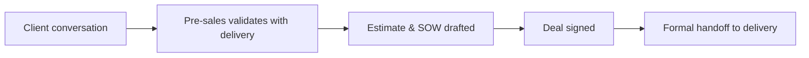

# Collaboration with Sales & Delivery
{: .no_toc }

*Read duration: 3:07*

You spend most of a deal sitting between two groups who don't naturally speak the same language. The **account executive (AE)** is optimizing for momentum — get the next meeting, remove the next objection, close by the forecasted date. **Delivery** (engineers, solutions architects, project managers who'll actually build and run the thing) is optimizing for feasibility — can this be built on this timeline, with this team, for this price, without everyone burning out in month two. Your job in pre-sales is to sit in the middle and make sure neither side's optimism creates a promise the other side can't keep.

## Where collaboration breaks down

The most common failure is the AE verbally committing to something in a client meeting — a go-live date, a custom integration, a headcount — that nobody from delivery has validated. You weren't in the room, or you were and didn't push back, and now it's "basically agreed" even though it never touched an estimate. The fix is procedural, not personal: route any commitment that affects scope, timeline, or cost through you first, even under deal pressure. A five-minute Slack message to a solutions architect — "can we realistically do this in 6 weeks?" — is cheaper than a delivery team discovering the commitment during kickoff.

## Building the working relationship

Three habits keep this friction manageable. First, loop delivery in early — even a 15-minute technical sanity check before a proposal goes out saves you from selling something unbuildable. Second, run a clean **handoff**: a short internal document (not the SOW itself) that captures what was discussed informally, what assumptions the estimate relies on, and what the client believes is included, so delivery isn't starting from a blank page and a signed contract. Third, treat the AE as a partner to manage, not just support — flag scope risk in plain business terms ("this adds two weeks and $40K, not a quick add") rather than technical jargon they'll gloss over.

{: .important }
> Never let a verbal promise to a client bypass technical validation — if delivery didn't confirm it, it isn't real yet, no matter how close the deal is to closing.

<!-- prevnext:start -->

---

| [&larr; Previous: Collaboration, Tools, and Change Control](./) | [Next: Documenting and Tracking Scope Changes &rarr;](02-documenting-and-tracking-scope-changes) |
|:---|---:|

<!-- prevnext:end -->
