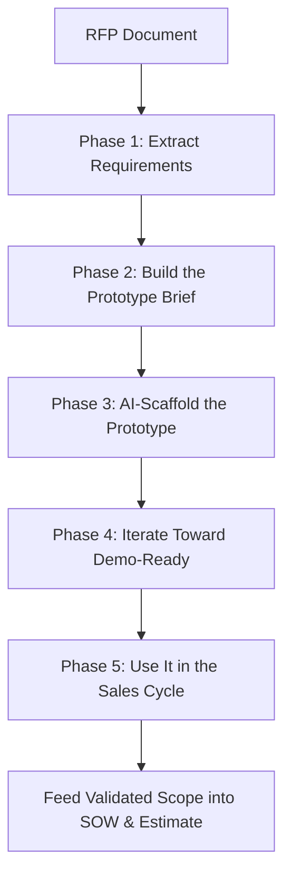

# From RFP to Clickable Prototype using AI
{: .no_toc }

*Read duration: 28:18*

## Why Build a Prototype During a Pre-Sales Cycle

Every vendor responding to the same RFP is answering the same numbered requirements in roughly the same order, in roughly the same tone. A buyer evaluating five proposals for a "case management portal" reads five variations of "Vendor will deliver a modern, user-friendly case management platform" and can't actually tell them apart on paper. A **clickable prototype** — an interactive, click-through mockup that behaves like a real application even though nothing behind it is truly functional — changes that dynamic completely. It's the difference between telling a buyer you understand their workflow and putting a screen in front of them that proves it.

Historically, this was out of reach during pre-sales. Building even a rough interactive prototype meant pulling a designer off billable work for a week to produce something that might not even win the deal, and that math rarely worked — most vendors skipped it and competed on proposal prose instead. AI changes the math: what used to take a designer a week can now take a pre-sales team a day or two. That's exactly why this deserves a full methodology instead of a two-minute mention, and why it's the longest lecture in this course. The rest of this lecture walks through that methodology end to end — from a raw RFP document to a prototype you're actually using in front of the buyer.

## Which Opportunities Deserve This Treatment

Not every RFP is worth this effort, and knowing which ones are is itself a pre-sales judgment call worth making deliberately rather than defaulting to "always" or "never." Three signals make a strong case for building a prototype: the RFP is UX-heavy (a portal, dashboard, or client-facing application, as opposed to a back-end integration or infrastructure engagement where a screen wouldn't demonstrate much), the deal is large or strategic enough to justify the day or two of internal time, and you'll get a live or recorded presentation opportunity to actually show it — a prototype built for an RFP that's scored purely on a written submission with no presentation stage loses most of its value, since a static screenshot in a PDF captures little of what makes it persuasive.

Where those signals are weak — a low-value renewal, a purely infrastructure scope, or a process that never gives you a room to present in — that same day or two is better spent tightening the proposal narrative and pricing instead. Treat the decision itself as a five-minute conversation early in the RFP response kickoff, not an afterthought you back into on day three.

## Phase 1: Extracting Requirements from the RFP

RFPs are rarely written for easy extraction. Requirements are scattered across a narrative section, a compliance appendix, and a spreadsheet of "shall" statements, often numbered inconsistently and repeated with slightly different wording in two different places of the same document. This is the first place AI earns its time back: feed the RFP text (or the relevant sections) to an AI tool and ask it to extract every requirement into a structured list — functional requirements, the user roles mentioned, whether each item is stated as mandatory or optional, and anything tied to the evaluation criteria or scoring rubric if the RFP includes one.

A prompt that works well is specific about the output shape, not just the task. "Summarize this RFP" produces a paragraph you still have to mine for details yourself. "Read this RFP and produce a table of requirements with columns for requirement text, source section, user role affected, and whether it's stated as mandatory or optional" produces something you can act on immediately, because the structure is what makes the output usable in Phase 2 instead of just another document you have to re-read closely.

{: .important }
> Treat AI-extracted requirements as a first pass, not a source of truth. Large RFPs get truncated or skimmed by the model, and a tool asked to summarize a forty-page document will occasionally infer a requirement that sounds plausible but isn't actually in the text. Reconcile the extracted list against the real document — the same discipline you'd apply to any RFP response — before you build anything on top of it.

The output of this phase should be a clean requirements matrix. For a hypothetical case management RFP, an early version might look like this:

| Requirement | Role | Priority | Source |
|---|---|---|---|
| Caseworkers can create and update case records | Caseworker | Mandatory | Sec. 3.2 |
| Supervisors can reassign cases across a team | Supervisor | Mandatory | Sec. 3.4 |
| External clients can check case status online | External client | Mandatory | Appendix B |
| Dashboard shows caseload by aging bucket | Supervisor | Nice-to-have | Sec. 3.4 |
| System retains a full audit trail of case edits | Compliance | Mandatory | Appendix C |

Notice that the last row — an audit trail requirement buried in a compliance appendix — is exactly the kind of item that's easy to miss on a fast manual read and easy for an AI tool to catch precisely because it isn't skimming. It won't end up on a prototype screen, but it belongs on your estimation and scope checklist, which is a second, quieter benefit of doing this extraction pass carefully.

A single extraction pass is rarely enough on a real RFP. It's worth running the same document through a second, narrower prompt aimed specifically at the sections most likely to hide scope-relevant detail — integration requirements, security and compliance language, and any section describing how the buyer will score responses. Buyers often bury a heavily-weighted evaluation criterion in a sentence of narrative text rather than the scoring table, and that's precisely the kind of detail that should shape which screens you choose to build in Phase 2, not just which sentences you write in the proposal.

## Phase 2: Turning Requirements into a Prototype Brief

A requirements matrix is not something you can hand to a prototyping tool and get a good result from directly — it's a list, not a story. Phase 2 is where you convert it into a **prototype brief**: a short document naming the personas (the user roles from the RFP), the three to five highest-value screens, and the core flow a viewer will click through from one to the next.

This is a judgment step, not a mechanical one, and it's the one place in this process where your own pre-sales instincts matter more than any tool's output. Don't try to prototype the whole system — a real case management platform might have forty screens; you have a day or two and a demo to win, not a product to ship. Pick the screens that map most directly to what the evaluation criteria (or your read of the client's real pain, from discovery) actually reward. For the RFP above, that likely means three screens: a caseworker's case detail view, because it's the daily-use screen every caseworker on the evaluation committee will judge you on instinctively; a supervisor's team dashboard with the aging-bucket view called out even though the RFP marks it "nice-to-have," because it's the kind of visible differentiator that makes a proposal memorable in a stack of otherwise similar submissions; and the external client status page, because it's the one piece of the system the buyer's own customers will see, which makes it disproportionately visible in a scoring committee's mind relative to its actual technical complexity.

Write the brief the way you'd brief a designer, not the way you'd write a requirements document: name each screen, what a user can click on it, and what happens next. "Case Detail screen: caseworker sees case summary, status, and history. Clicking 'Reassign' opens a modal asking for a new owner and reason; confirming returns to the detail view with an updated assignment banner." That level of specificity is what keeps Phase 3 fast. AI tools scaffold far better from a concrete, sequenced brief like this than from the raw RFP, because the brief has already done the thinking that would otherwise happen through twenty rounds of vague back-and-forth with the tool.

## Phase 3: Scaffolding the Prototype with AI

With a brief in hand, you're ready to generate the actual interface. A category of tools has emerged specifically for this: AI-native prototyping and app-builder tools — the category includes tools like v0, Lovable, and Bolt — that take a written prompt or brief and generate a working, clickable front end directly, rather than a static image of one. That's the important distinction from a design tool: the output is something a viewer can actually click through — open a case, see a detail view, click "reassign," see a confirmation — not a flat picture of a screen that only looks interactive.

| Tool category | What it produces | Best for | Watch out for |
|---|---|---|---|
| AI app/prototype builders | Clickable, multi-screen front end generated from a text prompt | Fast, interactive proposal demos | Generic visual polish unless you push it toward client branding and terminology |
| AI-assisted design tools | High-fidelity static or lightly interactive mockups | Screens where visual craft matters more than click-through flow | Less useful for demonstrating multi-step workflows end to end |
| General LLM chat assistants | Code snippets, page markup, or content you assemble yourself | Teams with an engineer who'll assemble the pieces | Slower — you're doing the integration work an app builder does for you automatically |

Feed the tool your Phase 2 brief, and go further than a generic prompt: include the client's actual terminology (if their RFP says "matter" instead of "case," use "matter" everywhere), plausible sample data drawn from their domain, and — if you have it — their brand colors and logo. A prototype populated with "Jane Doe, Case #4471, opened 3/12" reads as generic; one populated with the client's own vocabulary and a handful of realistic, industry-appropriate sample records reads as if you'd already started building their system specifically. That difference is most of what makes this technique effective in a sales context — it's less about the AI itself and more about specificity, and AI is simply what makes that level of specificity affordable on a proposal timeline.

Ask for the core flow first — the two or three screens that matter most from your brief, connected to each other — rather than everything at once. A working three-screen flow you can demo confidently beats an eight-screen prototype where half the buttons don't go anywhere, and it's far easier to extend a working flow than to fix a sprawling broken one under deadline pressure.

### A Worked Prompt Example

Vague prompts produce generic prototypes; specific prompts produce ones that feel like they were built for this client. Compare the two approaches on the same brief:

A thin prompt — "Build me a case management app with a dashboard and case detail page" — will generate something structurally plausible but visually and contextually generic: default sample names, a default color scheme, and screens that could belong to any vertical from healthcare to logistics. You'll spend your limited iteration rounds fixing genericness instead of adding real value.

A specific prompt does the opposite: "Build a two-screen prototype for a government caseworker portal. Screen 1 is a supervisor dashboard showing active cases grouped by aging bucket (0-7 days, 8-30 days, 30+ days) with a count badge per bucket, using a navy-and-white color scheme. Screen 2 is a case detail view opened by clicking a case row, showing case ID, client name, status, and a 'Reassign' button that opens a modal asking for a new owner and a reason before confirming. Use realistic sample case data with names and case numbers, not placeholder text." That prompt gives the tool almost everything it needs to produce something you could plausibly demo an hour later, because every ambiguous decision the tool would otherwise have to guess at has already been made for it.

The pattern generalizes: the quality of what you get back is a direct function of how much of Phase 2's thinking you actually put into the prompt, rather than leaving the tool to fill the gaps with generic defaults.

## Phase 4: Iterating Toward Something Demo-Ready

The first generation is a starting point, not a finished prototype — treat it the same way you'd treat an AI-drafted proposal section: a fast first draft you now refine, not something you ship as-is. Iteration here is conversational: point the tool at what's wrong ("move the case status badge to the top right," "the reassignment flow should ask for a reason before confirming," "match this blue to our client's brand color") and regenerate. Most of these tools support several rounds of this kind of refinement in less time than it would take a designer to open their file for a first revision.

Two things matter more than visual polish at this stage. First, pull in whoever will actually deliver the work — a solutions architect or delivery lead — for a quick sanity check before the prototype goes anywhere near the client. A prototype can click through a workflow that isn't actually feasible to build the way it's shown on the screen, and nothing damages credibility faster in a follow-up conversation than a buyer asking "so this is what we're getting" about a flow your own delivery team already knows won't work as demonstrated. A five-minute internal review catches this before it becomes an awkward walk-back in front of the client.

Second, resist the pull to keep adding screens just because the tool makes it easy to. A tight three-screen flow that maps directly to the buyer's stated priorities outperforms a sprawling ten-screen prototype that dilutes the story, takes longer to iterate on, and multiplies the number of places something can look unfinished. Every screen you add is also another thing you're implicitly promising — which is exactly the discipline the next section builds on.

## Phase 5: Using the Prototype in the Sales Cycle

A finished prototype has several real uses beyond simply looking impressive. The most direct is in an oral defense or finalist presentation: walking a scoring committee through a live, clickable screen instead of a slide of static screenshots is a genuinely different experience for the room, and it's one most competitors responding with slide decks and prose won't be offering. It also works well embedded directly in the written proposal, as a link or a short recorded walkthrough, giving reviewers who never make it to a live presentation the same experience asynchronously.

Less obviously, using the prototype in a follow-up discovery conversation is one of the highest-value moves available to you. Put it in front of the client and watch what they react to — buyers routinely say some version of "oh, actually, we'd also need to filter by region here" or "our supervisors don't reassign cases directly, they route requests through a queue first." Those are real requirements surfacing before the SOW is signed instead of after delivery has already started, which is exactly the gap that turns into a change order six weeks into a project. A prototype makes abstract scope language concrete enough that a client's own domain expert can spot what's missing in a way they rarely can from reading a paragraph of proposal prose.

That feedback loop is also the bridge back into the rest of your proposal. Once a screen or flow has been walked through and validated with the client, it stops being an idea and becomes a named, specific deliverable in your SOW's scope section — the same discipline of naming countable deliverables covered elsewhere in this course — and a concrete unit your estimation is built around, rather than a vague outcome statement like "modernize the case management experience." The prototype, in other words, isn't just a sales aid; it's scoping work that happens to double as one.

### Setting the Timeline

Because this whole exercise lives inside an already-tight RFP response window, it helps to plan it as its own mini-schedule rather than an open-ended side project. A realistic breakdown for a mid-size RFP looks something like this:

| Day | Focus | Owner |
|---|---|---|
| Day 1, morning | Extract requirements, reconcile against the RFP | Pre-sales lead |
| Day 1, afternoon | Write the prototype brief, pick 3-5 screens | Pre-sales lead + solutions architect |
| Day 1, evening | First AI-generated pass of the core flow | Pre-sales lead |
| Day 2, morning | Iterate on layout, branding, sample data | Pre-sales lead |
| Day 2, midday | Feasibility sanity check with delivery | Solutions architect |
| Day 2, afternoon | Final polish, record a walkthrough as backup | Pre-sales lead |

Holding to a schedule like this is as much about discipline as it is about tooling — it's what keeps Phase 2's "pick three to five screens" rule from quietly eroding into "just one more screen" over and over until the prototype has eaten three days you didn't have.

## Presenting It Live: Handling Buyer Questions

A live prototype changes the texture of a presentation, and buyers react to that change by asking sharper, more specific questions than they would about a slide deck — which is exactly the point, but it means you should walk in prepared for it. Three questions come up often enough to prepare for by name.

"Is this built, or is this a mockup?" Answer this directly and early, ideally before anyone asks — a version of "what you're seeing is an interactive prototype we built to validate the workflow with you; it's not connected to real data or systems yet" said in your opening thirty seconds does more good than a defensive answer said after someone asks it skeptically. Buyers respect the honesty, and it doesn't diminish the impact of what they're seeing.

"Can it also do [feature not in the prototype]?" Resist improvising an answer that implies yes. A safe, honest response acknowledges the question as a real requirement, notes it wasn't in scope for this prototype, and commits to addressing it in the SOW — which is also exactly the kind of signal you want, since it's a live example of the prototype surfacing a requirement gap in real time, in front of the room, which reinforces rather than undermines your credibility.

"How long would the real thing take to build?" This is the moment the prototype and your estimation work meet. Resist letting the prototype's speed of creation imply the real system will be similarly fast — a two-day prototype and a production system with security review, data migration, and integration work are not the same clock. Tie your answer back to the estimate your team has actually built, and use the prototype to explain what's driving the number, not to imply the number should be smaller because the prototype came together quickly.

## Guardrails Worth Repeating

A few things are easy to get wrong with this technique, and each one is more expensive to fix after the fact than before you start.

**Confidentiality first.** An RFP typically arrives after an NDA is already in place, and its contents are the client's confidential information regardless of how public the document itself might feel. Only run RFP text and extracted requirements through AI tools that are covered by your organization's own data-handling and enterprise agreements — never a personal or unapproved public tool, no exceptions for how tempting the shortcut looks on a tight deadline.

**Time-box it.** This entire process — extraction through a demo-ready prototype — should run in one to two days, not one to two weeks. If it's taking longer, you've likely violated the Phase 2 discipline of picking a small number of high-value screens instead of quietly trying to cover the whole system.

**Manage what the prototype implies.** Be explicit with the client, every time you show it, that this is a prototype built to validate the workflow and prove understanding — not the delivered product, not connected to real systems, and not built on the client's actual data. The same rule that governs a SOW applies here: if it isn't written into the SOW, a client saying "but the prototype already did this" carries no more contractual weight than a verbal commitment does. Set that expectation before the buyer sets it for you, and you turn what could be a liability into what it actually is — the fastest, most persuasive proof of understanding you can put in front of a buyer during pre-sales.

<!-- prevnext:start -->

---

| [&larr; Previous: Using AI in Pre-Sales — Your Smartest Ally](01-using-ai-in-pre-sales-your-smartest-ally) | [Next: AI Project Ideation: Predictive, Generative, and Agentic AI &rarr;](03-ai-project-ideation-predictive-generative-and-agentic-ai) |
|:---|---:|

<!-- prevnext:end -->
